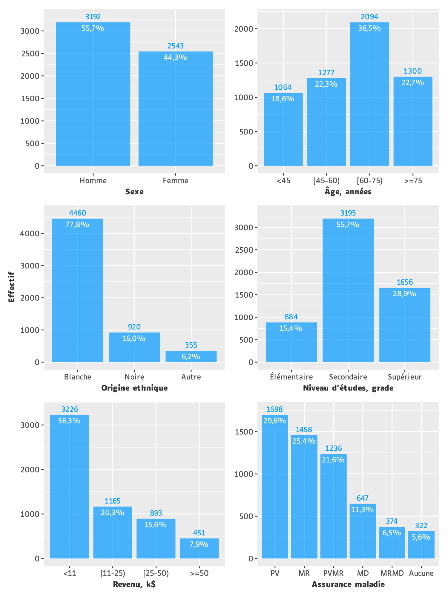
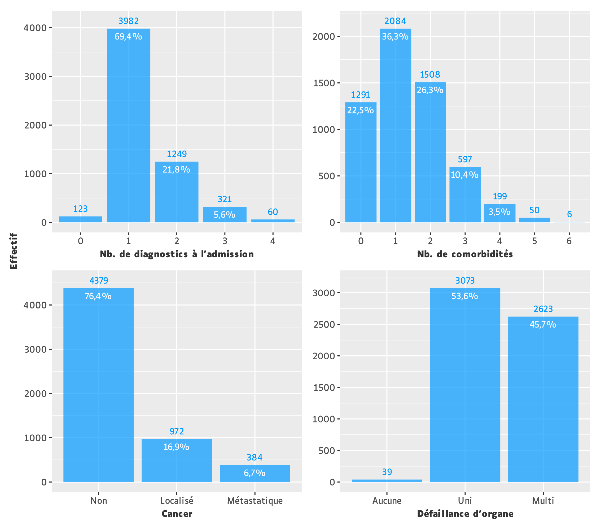
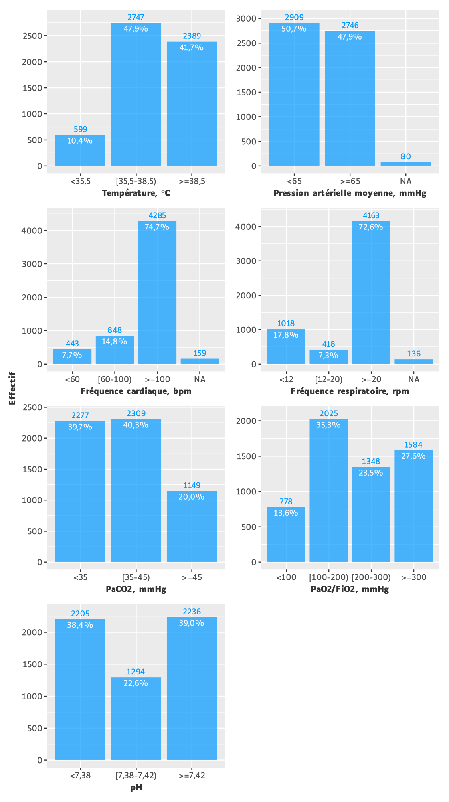
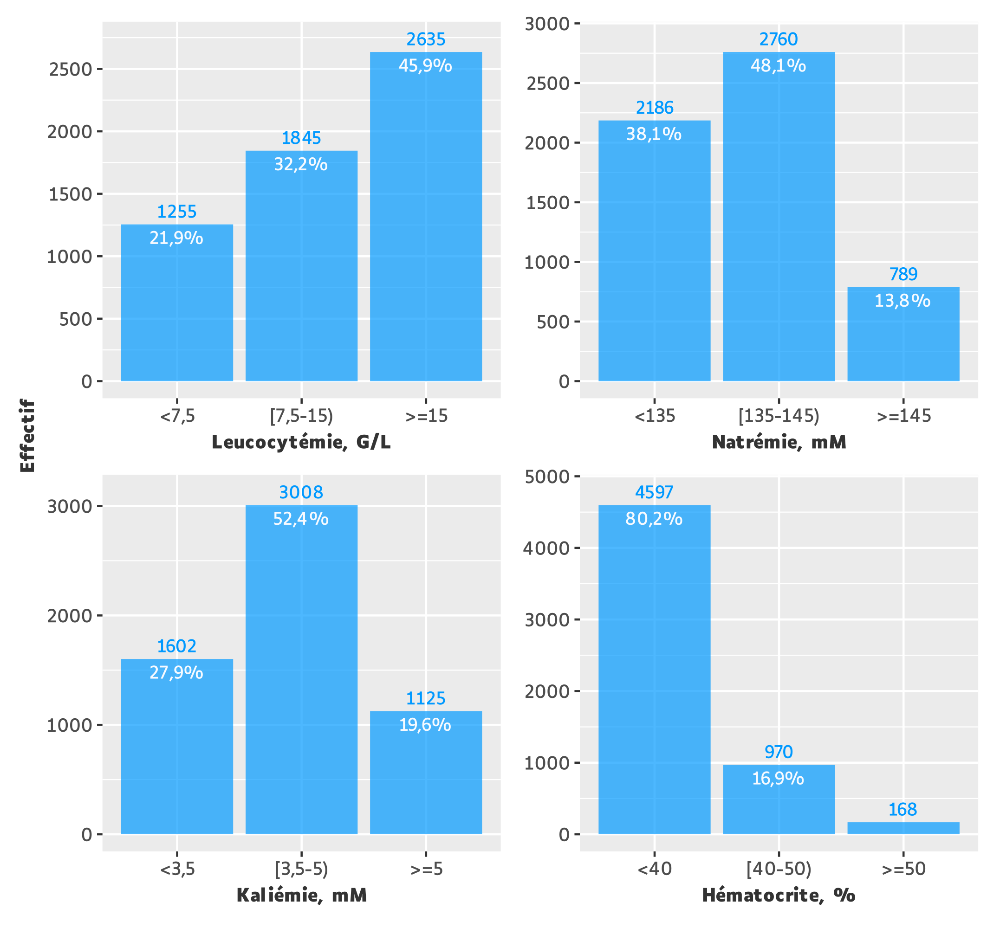
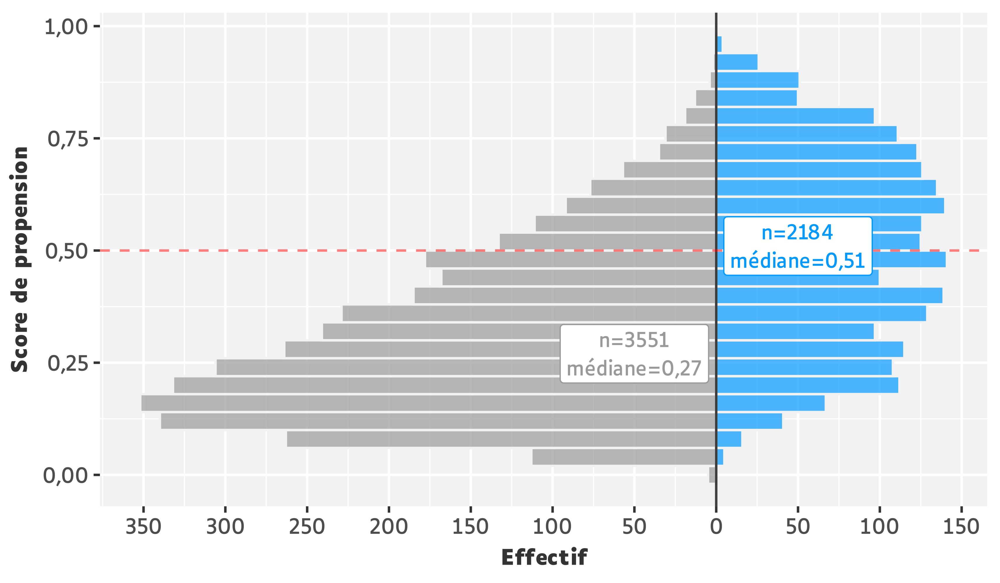
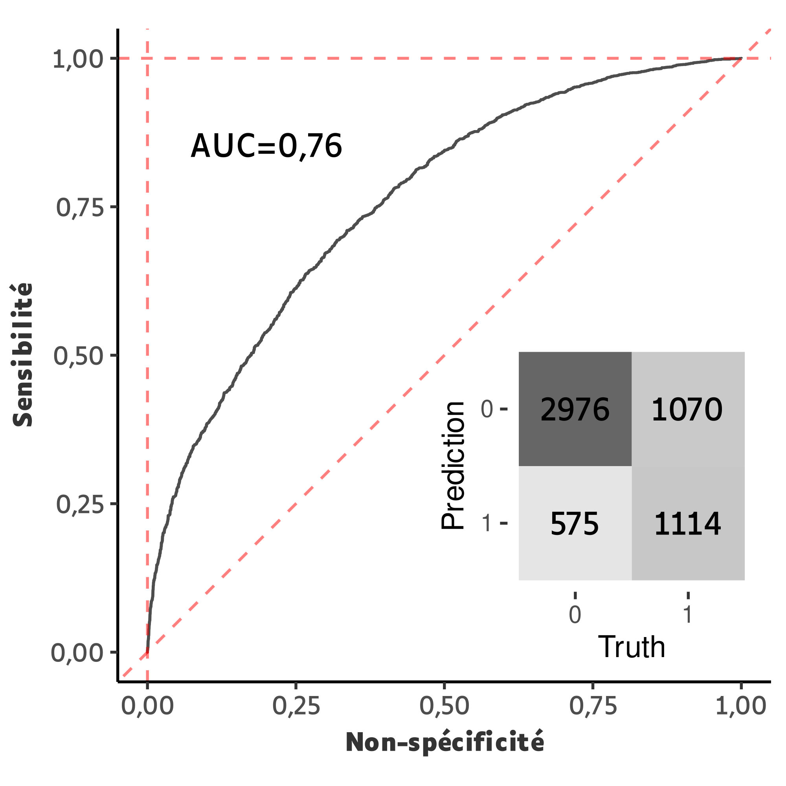
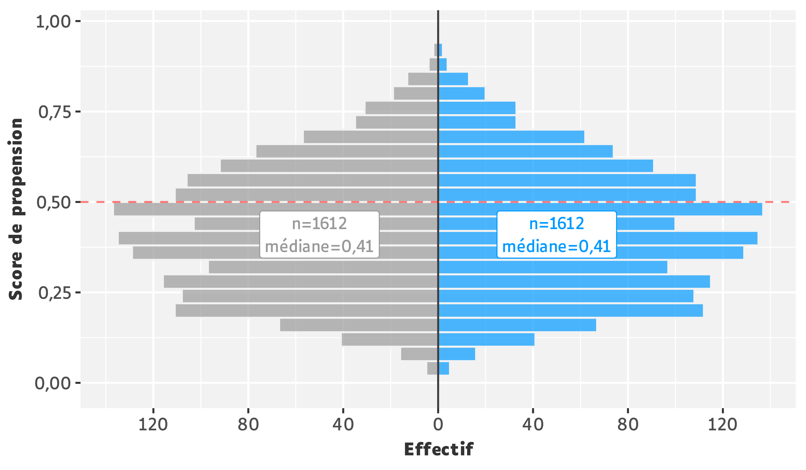
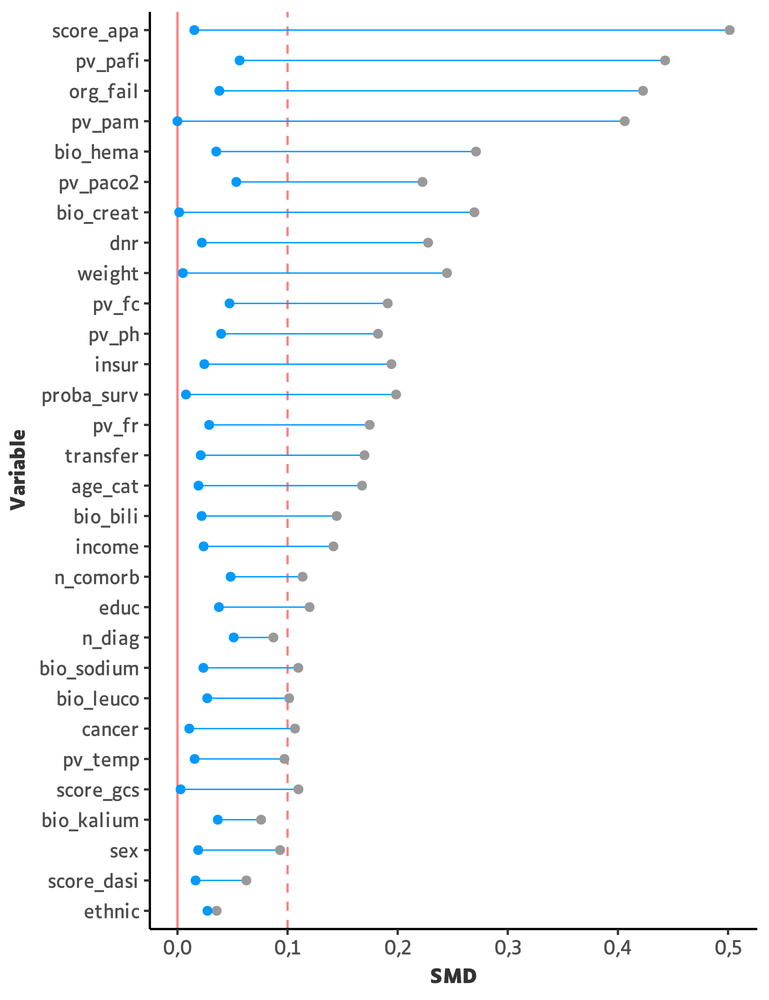
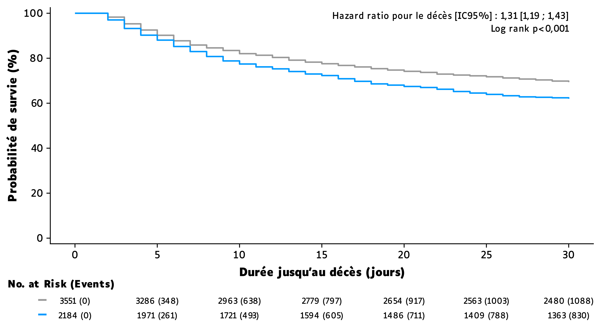
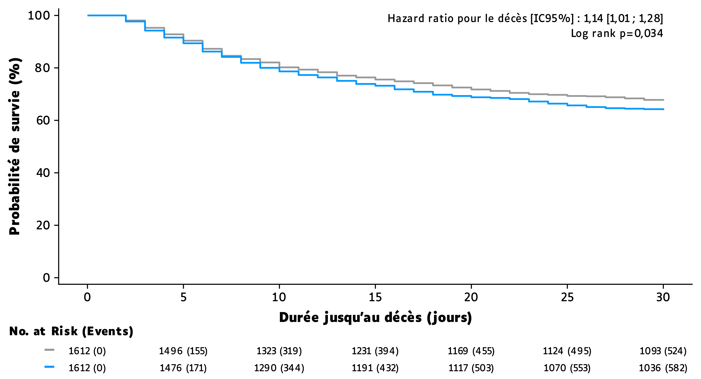

```{r}
#| include: false
library(knitr)
library(gt)

options(easy_out.quiet = TRUE)

# .gt_format <- hebstr::gt_format
# gt_format <- \(x, ..., font_size = 16, row_padding = 10) {
#   .gt_format(x, font_size = font_size, row_padding = row_padding, ...)
# }

source(here::here("scripts", "_setup.R"))

auto_exec()

.pal <- opts$palette
```

# Énoncé {.unnumbered .unlisted}

Ce devoir portait sur les données d'une **étude observationnelle** réalisée en unité de soins intensifs : [Connors *et al.* (1996): The effectiveness of RHC in the initial care of critically ill patients. *J American Medical Association* 276:889-897.](https://jamanetwork.com/journals/jama/article-abstract/407990)

L'objectif était de comparer **le risque de mortalité à 30 jours** entre les sujets ayant subi la pose d'une sonde de Swan-Ganz dans les 24h suivant l'admission en soins intensifs et les sujets n'ayant pas subi l'intervention.

La pose de sonde de Swan-Ganz était qualifiée pour la suite de **cathétérisme droit** (variable `rhc`).

::: callout-note
# Note

L'ensemble du code est divisé en 2 types de scripts :

- Préparation des données (`_setup.R`)
- Production des tableaux et figures (`tbl_*.R` ou `fig_*.R`)

Les paramètres et objets définis dans `_setup.R` sont injectés dans les scripts tableaux et figures, exécutés en aval, afin d'éviter toute duplication de code.

Les tableaux et figures numérotés sont précédés de leur script respectif (replié par défaut). Si plusieurs éléments sont produits par un même script, celui-ci est placé soit uniquement devant le premier élément, soit placé à plusieurs reprises avec une numérotation.

L'ensemble du matériel est accessible depuis un dépôt git en cliquant sur [</> Code]{.nb} en haut à droite de la page.

Aucun large language model n'est utilisé pour la rédaction du code ou du texte.
:::

::: callout-important
# Le contenu de ce devoir n'est pas corrigé
:::





# Data management

```{r}
.labels_qmd <- list(
  ptid = "identifiant patient",
  cat1 = "cat. diag. principale",
  cat2 = "cat. diag. secondaire",
  sadmdte = "date d'admission",
  dschdte = "date de sortie",
  lstctdte = "date de dernier contact",
  dthdte = "date de décès",
  death = "décès",
  adld3p = "échelle ADL",
  alb1 = "albuminémie",
  urin1 = "diurèse"
)

df_qmd <- df_base |> set_variable_labels(!!!.labels_qmd)
```

## Composition initiale

Le jeu de données était constitué de **`r nrow(df_base)` observations** pour **`r ncol(df_base)` variables** (sans prise en compte du numéro de ligne). Il se présentait au format long, soit une ligne par sujet. Il n'y avait pas de doublons.

### Valeurs aberrantes

Les variables suivantes contenaient des valeurs numériques **égales à 0 et jugées aberrantes** :

```{r}
opts$view$data |>
  filter(!is.na(n_miss), str_ends(variable, "weight|pam|fc|fr")) |>
  select(variable, label, n_ab = n_miss, p_ab = p_miss) |>
  gt_qmd()
```

### Valeurs manquantes

Les variables suivantes contenaient initialement des valeurs **manquantes** :

```{r}
easy_view(df_qmd)$data |>
  filter(!is.na(n_miss)) |>
  select(variable, label, n_miss, p_miss) |>
  gt_qmd()
```

Il paraissait normal que l'ensemble des sujets puissent ne pas tous être porteurs d'un diagnostic secondaire.

La date de sortie manquante était considérée ***completely at random***.

Le nombre d'occurrence de la variable binaire `death`, correspondant au statut "décédé oui/non", était égale au nombre de sujets ayant une date de décès.

```{r}
#| echo: true
#| code-fold: false
identical(
  sum(df_base$death == "Yes"),
  sum(!is.na(df_base$dthdte))
)
```

Ainsi il était possible d'affirmer que les dates de décès manquantes correspondaient à la **non-survenue du décès**.

La raison pour laquelle ADL et diurèse contenaient une telle proportion de valeurs manquantes n'était pas évidente. Celles-ci étaient considérées ***completely at random***.

::: callout-important

# Remarque sur la variable `death`

Selon la documentation fournie, la variable binaire `death` était renseignée comme étant la **mortalité à 180 jours**. Or le nombre d'occurrences positives de cette variable était égal au nombre total de sujets décédés.

```{r}
#| echo: true
#| code-fold: false
count(df_base, death)
```

Le calcul *de novo* d'une variable **"mortalité à 180 jours"** rapportait des effectifs différents.

```{r}
#| echo: true
#| code-fold: false
df_base |>
  count(
    death_180 = case_when(
      as.numeric(dthdte - sadmdte) <= 180 ~ "Yes",
      .default = "No"
    )
  )
```

Par conséquent la variable `death` correspondait bien, comme son nom l'indique, à la **mortalité toutes périodes confondues**, [et non à la mortalité à 180 jours comme l'indiquait son libellé]{.cb2}.

:::

## Recodage des variables

Hormis un formatage de base de la plupart des variables (i.e. renommage, factorisation, formatage des dates), certaines modifications spécifiques ont été réalisées.

### Synthèse des catégories diagnostiques

Les modalités des variables catégorielles `cat1` et `cat2` étaient les suivantes :

```{r}
.val_cat <-
  exprs(cat1, cat2) |>
  map(
    ~ df_base |>
      count(!!., sort = TRUE) |>
      rename(!!.labels_qmd[[.]] := 1)
  )
```

```{r}
#| layout-ncol: 2
gt_qmd(.val_cat[[1]])

gt_qmd(.val_cat[[2]])
```

Ces variables étaient considérées problématiques du fait d'un mélange de complications aiguës et de pathologies chroniques.

Chez les sujets ayant au moins une occurrence **"cancer"** en `cat1` ou `cat2`, la variable `cancer` était systématiquement codée **"métastatique"**.

```{r}
#| echo: true
#| code-fold: false
df_base |>
  filter(if_any(c(cat1, cat2), str_detect, "Cancer")) |>
  count(cancer)
```

L'information relative au cancer étant déjà présente dans la variable `cancer`, la décision a été prise de **supprimer** les occurrences "cancer" de `cat1` et `cat2` par une conversion en **valeurs manquantes**.

Quant à des modalités telles que cirrhose ou BPCO, il n'y avait aucune indication concernant leur caractère aigu ou chronique. À défaut nous avons considéré qui s'agissait bien de **décompensations aiguës** et que leur présence au sein de ces variables était donc justifiée.

Aucune distinction n'était faite entre les deux catégories de défaillance multiviscérale "MOSF".

Finalement, l'information apportée par `cat1` et `cat2` a été regroupée en une nouvelle variable catégorielle substitutive nommée **"défaillance d'organe"** (`org_fail`) :

| **modalité** | **condition**                                                |
|:------------:|:-------------------------------------------------------------|
| aucune       | aucun diagnostic parmi `cat1` et `cat2`                      |
| uni          | un seul diagnostic parmi `cat1` et `cat2` hormis MOSF        |
| multi        | deux diagnostics ou au moins une MOSF parmi `cat1` et `cat2` |

### Synthèse des diagnostics et comorbidités

L'information relative aux diagnostics à l'admission a été synthétisée en une nouvelle variable numérique **"nombre de diagnostics à l'admission"** (`n_diag`), comptabilisant la somme des diagnostics à l'admission pour chaque sujet.

L'information relative aux comorbidités (variables `*hx` hormis `transhx`) a été synthétisée en une nouvelle variable numérique **"nombre de comorbidités"** (`n_comorb`), comptabilisant la somme des comorbidités pour chaque sujet.\
Seule la variable `transhx` correspondant au **"transfert interhospitalier >24h"** a été extraite de cette catégorie et conservée telle quelle.

### Factorisation du niveau d'études

La variable numérique **"niveau d'études"** représentait le nombre d'années de scolarisation dans le système étasunien. Elle a été factorisée en 3 catégories :

| **modalité** | **description**                                              |
|:------------:|:-------------------------------------------------------------|
| élémentaire  | <= 8 années (équivalent collège dans le système français)    |
| secondaire   | 9 à 12 années (équivalent lycée dans le système français)    |
| supérieur    | > 12 années                                                  |

### Conversion des unités de mesures

Les variables suivantes ont été converties en unités du Système International :

- Bilirubinémie : exprimée en mg/dL, convertie en μM (x 17,1)
- Créatininémie : exprimée en mg/dL, convertie en μM (x 88,4)

::: callout-note
# Note

Les variables "bilirubinémie" (`bio_bili`) et "créatininémie" (`bio_creat`) sont les seules variables biologiques n'ayant pas été catégorisées du fait qu'elles s'interprètent davantage de manière continue que graduelle.
:::

Le score de Glasgow, coté de 0 (vigilance normale) à 100 (coma), a été replacé sur une **échelle de 3 à 15** par transformation linéaire (15 - valeur x 0,12).

### Calcul des délais et outcomes

Les variables suivantes ont été créées sur la base des dates d'admission, de sortie d'hospitalisation et de décès.

```{r}
opts$view$data |>
  select(variable:p_miss) |>
  filter(str_starts(variable, "tt|death")) |>
  gt_qmd()
```

Aucune erreur logique ne fut retrouvée.

```{r}
#| echo: true
#| code-fold: false
df_base |>
  filter(dschdte < sadmdte | dthdte < dschdte) |>
  nrow()
```

### Classes d'âges

Une variable catégorielle *"classes d'âges"* (`age_cat`) a été créée sur la base de la variable continue `age`.

```{r}
opts$view$data |>
  select(variable:type, levels) |>
  filter(variable == "age_cat") |>
  gt_qmd()
```

### Exclusions

Certaines variables ont été exclues du jeu de données pour trois raisons.

```{r}
exclus_list <-
  list(
    trop_miss = c("adld3p", "urin1"),
    pas_interp = c("lstctdte", "alb1"),
    pas_util = c("ptid", "cat1", "cat2", "sadmdte", "dschdte", "dthdte", "death")
  ) |>
  map(
    ~ df_qmd |>
      relocate(names(.labels_qmd)) |>
      easy_view() |>
      pluck("data") |>
      filter(variable %in% .) |>
      select(where(~ !is_null(unlist(.))), -pos)
  )
```

1. **Excès de valeurs manquantes** :

```{r}
gt_qmd(exclus_list$trop_miss)
```

\

2. **Interprétabilité trop incertaine** :

```{r}
gt_qmd(exclus_list$pas_interp) |>
  sub_missing(missing_text = "")
```

\

3. **Pas ou plus d'utilité future** :

```{r}
gt_qmd(exclus_list$pas_util) |>
  sub_missing(missing_text = "")
```

### Gestion des valeurs aberrantes

Les valeurs jugées aberrantes ont été converties en **valeurs manquantes**.

La proportion de valeurs manquantes pour chacune des variables suivantes était jugée raisonnable :

```{r}
gt_qmd(.miss_data)
```

## Composition finale

Ci-dessous le récapitulatif des variables analysées :

```{r}
opts$view$output
```

```{r}
.title_descr_base <-
  map(
    c(
      demo = "variables sociodémographiques",
      atcd = "antécédents et comorbidités",
      pv = "paramètres vitaux",
      bio = "paramètres biologiques",
      bin = "variables binaires",
      qt = "variables continues"
    ),
    ~ glue("Caractéristiques des {.}")
  )

.title_descr <-
  map(
    c(
      uv = ".",
      death = " selon la mortalité à 30 jours.",
      rhc = " selon la pose de cathétérisme droit."
    ),
    ~ glue("{.title_descr_base}{.}")
  )
```

# Analyse descriptive univariée

Les variables catégorielles ont pu être regroupées en 4 catégories :

- Variables sociodémographiques
- Antécédents et comorbidités
- Paramètres vitaux (`pv_*`)
- Paramètres biologiques (`bio_*`)



```{r}
#| label: fig-uv-demo
#| out-width: 90%
#| fig-align: center
#| fig-cap: !expr '.title_uv_demo'
.acro <-
  opts$acro |>
  with(mget(str_subset(names(opts$acro), str_u(levels(df_setup$insur))))) |>
  acro_str(collapse = opts$sep$ext)

.title_uv_demo <-
  str_fig(title = .title_descr$uv[1], acro = .acro, qmd = TRUE)


```

\

```{r}
#| label: fig-uv-atcd
#| fig-cap: !expr ".title_descr$uv[2]"

```

\

```{r}
#| label: fig-uv-pv
#| out-width: 85%
#| fig-cap: !expr ".title_descr$uv[3]"

```

\

```{r}
#| label: fig-uv-bio
#| out-width: 85%
#| fig-cap: !expr ".title_descr$uv[4]"

```



```{r}
#| label: tbl-uv-bin
#| tbl-cap: !expr '.title_descr$uv[5]'
tbl_uv_bin
```

```{r}
#| label: tbl-uv-qt
#| tbl-cap: !expr '.title_descr$uv[6]'
tbl_uv_qt
```

::: callout-important
# Parti pris

Seules les distributions du **poids** (`weight`) et du **score APACHE III** (`score_apa`) ont été considérées approximativement normales.
:::

# Analyse descriptive bivariée

L'analyse précédente a été reproduite après croisement sur 2 variables :

  - Mortalité à 30 jours (`ev_death_30`)
  - Cathétérisme droit (`rhc`)

## Mortalité à 30 jours



```{r}
#| label: tbl-bv-ql-demo-ev-death-30
#| tbl-cap: !expr ".title_descr$death[1]"
tbl_bv_ql$demo$demo_ev_death_30
```

```{r}
#| label: tbl-bv-ql-atcd-ev-death-30
#| tbl-cap: !expr ".title_descr$death[2]"
tbl_bv_ql$atcd$atcd_ev_death_30
```

```{r}
#| label: tbl-bv-ql-pv-ev-death-30
#| tbl-cap: !expr ".title_descr$death[3]"
tbl_bv_ql$pv$pv_ev_death_30
```

```{r}
#| label: tbl-bv-ql-bio-ev-death-30
#| tbl-cap: !expr ".title_descr$death[4]"
tbl_bv_ql$bio$bio_ev_death_30
```



```{r}
#| label: tbl-bv-qt-bin-ev-death-30
#| tbl-cap: !expr ".title_descr$death[5]"
tbl_bv_qt$bin$ev_death_30
```

```{r}
#| label: tbl-bv-qt-qt-ev-death-30
#| tbl-cap: !expr ".title_descr$death[6]"
tbl_bv_qt$qt$ev_death_30
```

## Cathétérisme droit



```{r}
#| label: tbl-bv-ql-rhc-demo
#| tbl-cap: !expr ".title_descr$rhc[1]"
tbl_bv_ql$demo$demo_rhc
```

```{r}
#| label: tbl-bv-ql-rhc-atcd
#| tbl-cap: !expr ".title_descr$rhc[2]"
tbl_bv_ql$atcd$atcd_rhc
```

```{r}
#| label: tbl-bv-ql-rhc-pv
#| tbl-cap: !expr ".title_descr$rhc[3]"
tbl_bv_ql$pv$pv_rhc
```

```{r}
#| label: tbl-bv-ql-rhc-bio
#| tbl-cap: !expr ".title_descr$rhc[4]"
tbl_bv_ql$bio$bio_rhc
```



```{r}
#| label: tbl-bv-qt-bin-rhc
#| tbl-cap: !expr ".title_descr$rhc[5]"
tbl_bv_qt$bin$rhc
```

```{r}
#| label: tbl-bv-qt-qt-rhc
#| tbl-cap: !expr ".title_descr$rhc[6]"
tbl_bv_qt$qt$rhc
```

# Score de propension

Dans la décision de procéder ou non à un cathétérisme droit, il a pu être à l'oeuvre un **biais d'indication** : comme semblait le montrer l'analyse bivariée, certains sujets pouvaient avoir des caractéristiques les rendant plus susceptibles de subir l'intervention, ce qui pouvait fausser les comparaisons entre groupes traités et non traités et mener à des conclusions erronées sur son efficacité.

Un **score de propension** a été créé dans le but de minimiser ce biais potentiel, en permettant d'évaluer l'efficacité du cathétérisme dans une situation où tous les sujets avaient la même probabilité de subir le geste.

## Imputation des données manquantes

Pour rappel, les variables suivantes comportaient des valeurs manquantes dans des proportions jugées raisonnables :

```{r}
gt_qmd(.miss_data)
```

Celles-ci ont toutes été traitées par **imputations multiples** en suivant la méthode des **forêts aléatoires** (10 imputations, 5 itérations).



## Description du modèle

```{r}
sp_vars_view <-
  opts$view$data |>
  select(variable, label) |>
  filter(variable %in% sp_vars) |>
  rownames_to_column()
```

Un modèle régression logistique a été réalisé afin de prédire la propension à subir un cathétérisme droit (variable `rhc`) en fonction des **`r {nrow(sp_vars_view)}` variables prédictives** suivantes :

```{r}
sp_vars_view |>
  gt_qmd(font_size = 13, data_row.padding = 4)
```

La distribution du score de propension dans l'ensemble de la population était la suivante :

```{r}
df_sp["sp"] |>
  tbl_wide_summary(statistic = opts$qt_stat_wide, digits = ~2) |>
  modify_header(stat_6 ~ glue("**{names(opts$qt_stat$mean)}**")) |>
  gt_qmd()
```

```{r}
.title_sp_dist <-
  map(
    c(global = "chez", match = "après appariement entre"),
    ~ glue(
      "Distribution du score de propension {.} les sujets
      {str_color('sans', .pal[1])} et {str_color('avec', .pal[2])} cathétérisme droit."
    )
  )

.sp_dist_match <-
  lst(
    cal = df_match_model$caliper,
    n_pair = sum(df_match$rhc == 0),
    total_pair = sum(df_setup$rhc == 1),
    p_match = percent(n_pair / total_pair, accuracy = 0.1)
  )

.title_sp_dist_match <-
  str_fig(
    title = .title_sp_dist$match,
    note = "Appariement 1:1 selon la méthode des plus proches voisins.
      Caliper fixé à {.sp_dist_match$cal} (brut). {.sp_dist_match$n_pair} appariements réalisés sur {.sp_dist_match$total_pair} possibles, soit avec une correspondance de {.sp_dist_match$p_match}.",
    qmd = TRUE
  )
```

La distribution du score de propension dans chaque groupe était la suivante



```{r}
#| label: fig-sp-dist-global
#| out-width: 85%
#| fig-cap: !expr '.title_sp_dist$global'
#| lightbox:
#|   group: fig-sp-dist

```

Dans une situation où le score de propension prédirait parfaitement l'allocation du cathétérisme, il n'y aurait aucune observation située au-dessus de la ligne horizontale chez les sujets sans et aucune située en dessous chez les sujets avec.

Dans le cas présent, parmi les sujets sans cathétérisme, une faible proportion était
considérée éligible à tord. Le modèle prédisait efficacement la non-allocution du cathétérisme chez les sujets ne l'ayant effectivement pas subi, ce qui laissait supposer d'une **bonne spécificité**.

Parmi les sujets avec cathétérisme, le modèle ne semblait pas capable de déterminer la propension des sujets à subir le geste. Autrement dit le modèle prédisait mal l'allocution du cathétérisme chez les sujets l'ayant effectivement subi, ce qui laissait supposer d'une **faible sensibilité**.

## Performances du modèle

Les performances supposées du score de propension ont pu être évaluées à l'aide d'une **courbe ROC**.



```{r}
#| label: fig-sp-roc
#| out-width: 50%
#| fig-cap: Courbe ROC du score de propension pour la classification du cathétérisme droit.

```

Une telle aire sous la courbe témoignait d'une capacité discriminante **faible à modérée**.

Les **paramètres intrinsèques** ont pu être calculés :

```{r}
.perf <-
  df_sp |>
  conf_mat(.pred_class, truth = rhc) |>
  tidy()

vn <- .perf$value[1]
total_n <- .perf$value[1] + .perf$value[2]
sp <- label_p()(vn / total_n)

vp <- .perf$value[4]
total_p <- .perf$value[4] + .perf$value[3]
se <- label_p()(vp / total_p)
```

- Sensibilité = `r vn` / `r total_n` = **`r se`**
- Spécificité = `r vp` / `r total_p` = **`r sp`**

## Appariement

Les sujets ont été appariés sur le score de propension selon un ratio **1:1**, par la méthode des plus proches voisins. Un caliper fixé à **`r .sp_dist_match$cal`** (`r .sp_dist_match$cal/0.2` * 0.2) semblait être un bon compromis entre qualité de l'appariement et préservation de la puissance.



```{r}
#| label: fig-sp-dist-match
#| out-width: 85%
#| fig-cap: !expr '.title_sp_dist_match'
#| lightbox:
#|   group: fig-sp-dist

```

L'appariement semblait visuellement satisfaisant.

```{r}
n_pair <- sum(df_match$rhc == 0)
n_total <- nrow(df_base)
p_match <- label_p()(n_pair * 2 / n_total)
```

Le jeu de données apparié était ainsi constitué de (`r n_pair` x 2) / `r n_total` = **`r p_match`** du jeu de données initial.
L'équilibrage des variables entre les groupes pouvait être évalué par le calcul des **différences moyennes standardisées**.



```{r}
#| label: fig-sp-smd
#| out-width: 60%
#| fig-cap: !expr '.title_smd'
.title_smd <-
  str_fig(
    title = "Différences moyennes standardisées (SMD) pour chaque variable
          constitutive du score de propension, {str_color('avant', .pal[1])}
          et {str_color('après', .pal[2])} appariement.",
    note = "{nrow(df_match) / 2} appariements sur le score propension
          selon un caliper fixé à {.sp_dist_match$cal} (brut). Les SMD
          étaient présentées en valeurs absolues et classées par valeurs
          globales décroissantes.",
    qmd = TRUE
  )


```

L'équilibrage entre les groupes après appariement sur le score de propension n'était pas parfait mais néanmoins considéré satisfaisant.

# Mortalité à 30 jours

L'objectif était de comparer la mortalité à 30 jours entre les groupes avec et sans cathétérisme droit.

Un **ajustement** sur le score de propension permettait de se placer dans une situation où l'allocation du cathétérisme serait non pas influencée par les caractéristiques du sujet, mais le plus possible **attribuable au hasard** à la manière d'une randomisation.

Dans une telle situation, il devenait théoriquement acceptable de conclure que s'il persistait une différence entre les groupes malgré cet ajustement, **alors elle serait probablement attribuable au geste**.

Le tableau suivant présente les odds ratios fournis par un modèle de régression logistique expliquant la mortalité à 30 jours en fonction de la présence ou non d'un cathétérisme droit, **avant puis après ajustement** sur le score de propension :

```{r}
compar_df |>
  imap(
    ~ workflow() |>
      add_model(.sp_model) |>
      add_formula(factor(ev_death_30) ~ rhc) |>
      fit(data = .x) |>
      tidy(exponentiate = TRUE, conf.int = TRUE) |>
      merge_estim_ci() |>
      filter(str_starts(term, "rhc")) |>
      mutate(term = .y, p.value = style_pvalue(p.value)) |>
      select(" " = term, "OR {opts$ci$label}" := estimate_ci, p.value)
  ) |>
  list_c() |>
  gt_qmd() |>
  tab_style(style = cell_text(align = "right"), locations = cells_body())
```

\

Sans ajustement, le cathétérisme droit était associée à un risque plus élevé de mortalité à 30 jours comparativement aux sujets n'ayant pas subi le geste.
Bien qu'elle fut atténuée, cette différence de risque semblait **persister après ajustement**.

L'estimation pouvait sensiblement varier en fonction des paramètres choisis (variables incluses dans le calcul du score de propension, choix du caliper, etc.),
mais semblait néanmoins toujours aller dans le sens d'une **diminution**.
Ainsi il a été jugé plus pertinent de porter des conclusions non pas sur des chiffres mais plutôt sur une tendance générale.

On pouvait donc retenir de cette analyse que la différence de risque de mortalité à 30 jours entre les groupes avec et sans cathétérisme droit tendait à être **plus faible après ajustement** sur le score de propension.

Cette tendance montrait que le risque de mortalité plus élevé chez les sujets ayant subi un cathétérisme pouvait être au moins en partie attribuable aux **caractéristiques des sujets** avant tout.
Quant à l'imputabilité de l'intervention, il paraissait difficile de l'affirmer en l'état.

# Analyse de survie

Cette tendance pouvait être confirmée à l'aide d'une **analyse time-to-event** ayant pour évènement la **mortalité à 30 jours**.

Une courbe de survie a été produite selon la méthode de Kaplan-Meier, ainsi qu'un modèle de Cox dans le but de quantifier le **risque instantané de décès** entre les groupes avec et sans cathétérisme.



::: panel-tabset

```{r}
.title_surv <-
  map(
    c(non_ajusté = "sans", ajusté = "après"),
    ~ str_fig(
      title = glue(
        "Comparaison du risque de mortalité à 30 jours
                       entre les sujets {str_color('sans', .pal[1])} et
                       {str_color('avec', .pal[2])} cathétérisme droit,
                       {.} ajustement."
      ),
      note = "Les courbes étaient construites suivant la méthode de Kaplan-Meier.
                Aucune censure n'était observée avant la date de point.",
      qmd = TRUE
    )
  )
```

# Sans ajustement

```{r}
#| label: fig-surv-non-ajusté
#| fig-cap: !expr '.title_surv$non_ajusté'
#| lightbox:
#|   group: fig-surv

```

# Après ajustement

```{r}
#| label: fig-surv-ajusté
#| fig-cap: !expr '.title_surv$ajusté'
#| lightbox:
#|   group: fig-surv

```

:::

Sans ajustement sur le score de propension, le groupe avec cathétérisme présentait un risque **significativement plus élevé** de mortalité à 30 jours comparé au groupe sans cathétérisme.

Après ajustement sur le score de propension, la différence de risque entre les groupes était **plus faible**.

# Conclusion

Le cathétérisme droit dans les 24h suivant une admission en soins intensifs était associé à un **risque plus élevé de mortalité à 30 jours**, comparativement aux sujets n'ayant pas subi l'intervention.
Une différence de risque entre les groupes **plus faible après ajustement** sur le score de propension révélait qu'un **biais d'indication** était probablement à l'oeuvre.

La nature **observationnelle** de l'étude, le **choix des variables** incluses dans le calcul du score de propension, la **perte de puissance** induite par l'appariement, étaient des facteurs limitant l'interprétabilité des résultats.
Un **essai randomisé** permettrait de porter de meilleures conclusions quant à l'imputabilité du cathétérisme droit sur la mortalité à 30 jours.

\

***

# Session {.unnumbered .unlisted}

```{r}
#| echo: true
devtools::session_info(pkgs = "attached")
```
